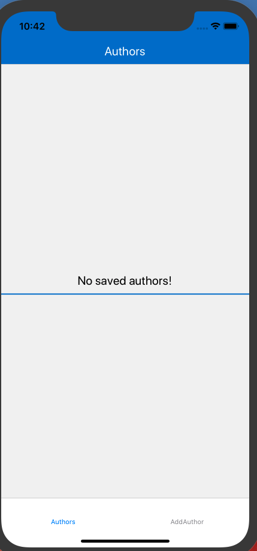
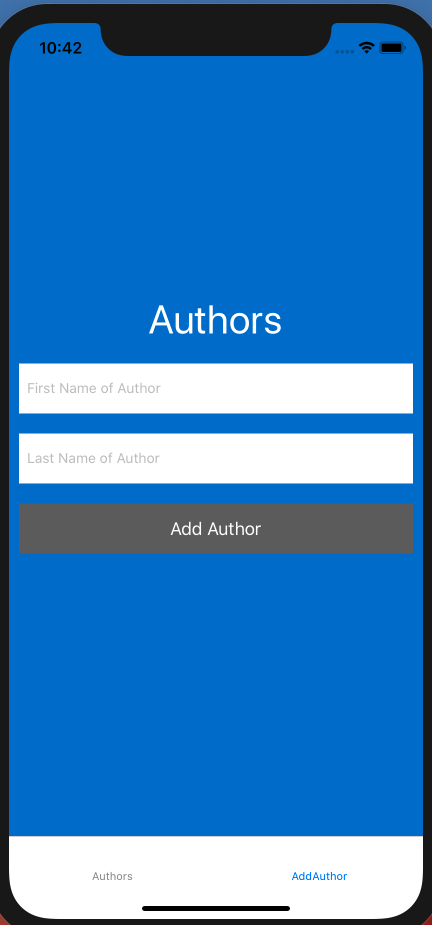
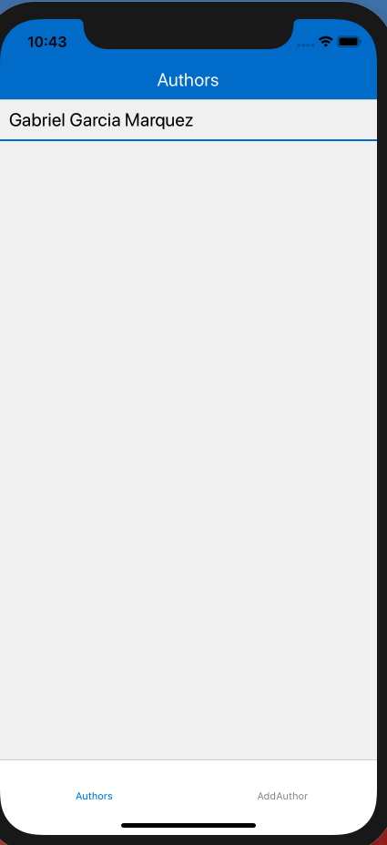
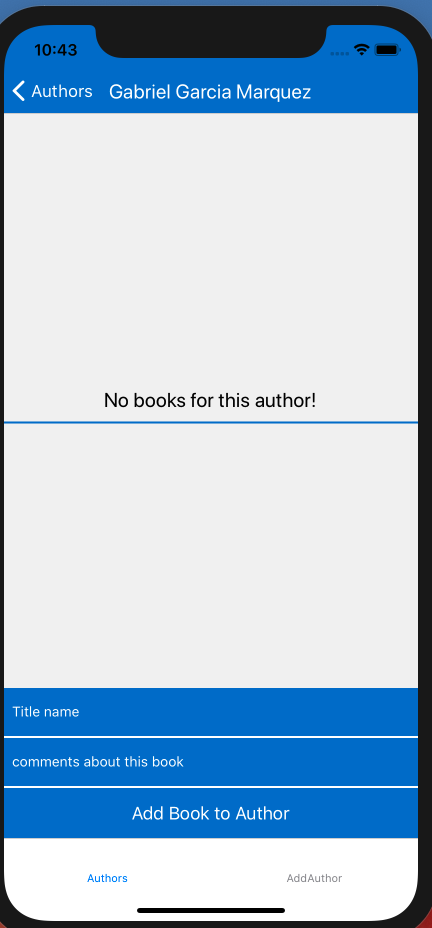
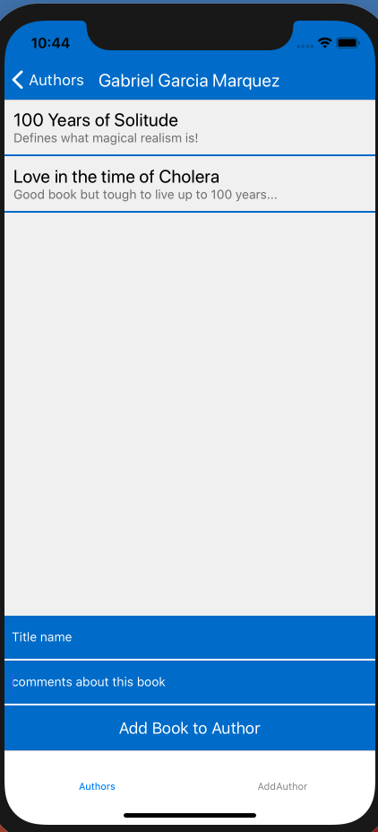
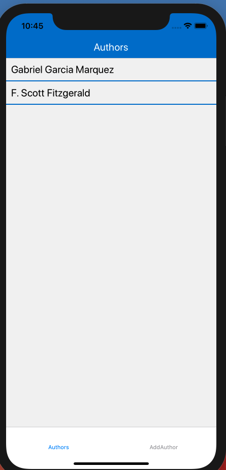
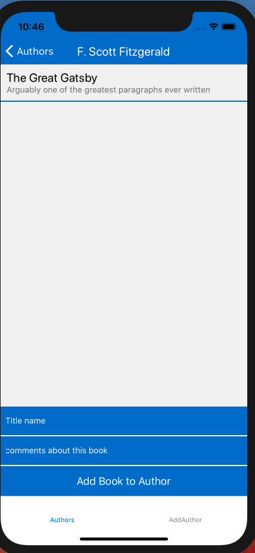

# Exercise 2: MyLibrary

## Due Date: Wednesday, January 22, 2020 11:59 PM
## Objectives: To complete a multi view react native application and understand how all the pieces fit together. Additionally to further gain experience with state management.

## Description  
The `MyLibrary` app you will be completing has both tab navigation and a stack navigation associated with one of the screens. When it first loads the user should be presented with a screen that notifies the user they have no authors in their digital library yet (This has already been done for you). The 2 tabs that make up the tab navigation are the AuthorsList tab on the bottom left and the AddAuthors tab on the bottom right. The application loads showing the AuthorsList view.  
When a user clicks on the AddAuthor button they will be routed to a simple form that takes in the first name and last name of the Author they wish to add. Upon submission they will be routed back to the AuthorsList view and should see a list of all their current authors in their database.  
When a user clicks on an authors name they will be routed to the next screen in the Authors stack which is where they can enter in the titles of books they have read for that author as well as a comment. Upon entering a new title the user will remain on that screen until they press either the back button or the Authors button at the bottom left.  

## Specifications/Requirements
We have provided you with the UI and all the styling for an app that you can use to keep track of the authors you have read as well as comments about specific books they have written. Most of the application has been stubbed out for you. You just need to look at the following 3 files and complete the methods with a `TODO` above the method.  
1. `screens/AddAuthor.js`  
2.  `screens/Author.js`  
3.  `App.js`  

Additionally I will be posting a `Questions.md` file that will serve as a list of questions that you need to complete with your project submission. You are allowed to use your notes and the web to look up the answers but you may not consult one another or any memeber of the teaching staff.

## Screenshots of the application in use 

View displayed on initial launch of the application 

  
  
Adding First Author

 

Viewing updated Author List 

Adding First Title 

Adding Second/Multiple Titles  

  

After adding a second author you should see this: 

 

And now adding titles to the second author  

 